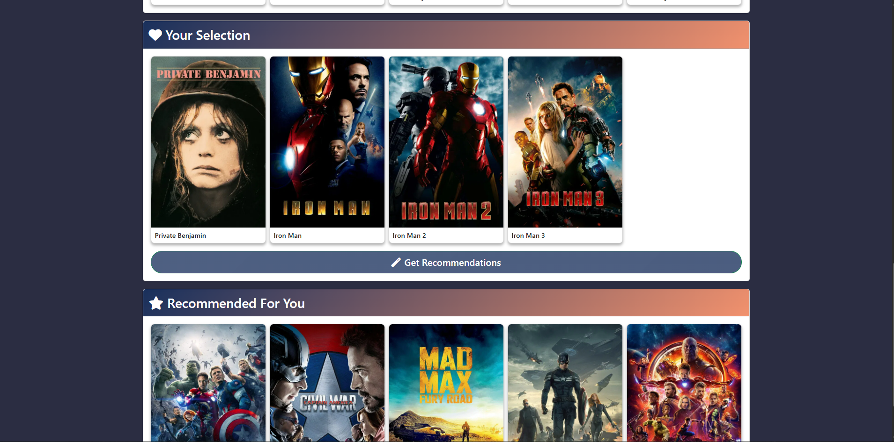

# Movie Recommendation System 🎬🍿

## Table of Contents
- [Project Overview](#project-overview)
- [Dataset](#dataset)
- [Features](#features)
- [Technologies Used](#technologies-used)
- [Installation](#installation)

---

## Project Overview
This system recommends movies by analyzing:
- **Plot descriptions** (NLP embeddings)
- **Genres** (e.g., Action, Romance)
- **Languages**  
- **Ratings & Popularity**  

Users select movies they enjoy, and the system suggests similar titles using **cosine similarity**.

---

## Dataset
**Source**: TMDB (The Movie Database)  
**File**: `top10K-TMDB-movies.csv`  
**Features Used**:
| Column            | Description                          |
|-------------------|--------------------------------------|
| `title`           | Movie name                           |
| `overview`        | Plot summary (for NLP analysis)      |
| `genre`           | Comma-separated genres               |
| `original_language` | Language code (e.g., "en")          |
| `vote_average`    | Average user rating (0-10)           |
| `popularity`      | TMDB popularity score                |
| `id`              | TMDB movie ID (for poster fetching)  |

---

## Features
### 🎯 Core Functionality
1. **Smart Search** with fuzzy matching
2. **Multi-Movie Recommendations** (combine 1-3 selections)
3. **Dynamic UI** with live poster loading

### 🛠️ Bonus Features
- Discover random movies

---

## Technologies Used
### 🖥️ Frontend
- HTML/CSS, JavaScript/jQuery
- Bootstrap 5, Font Awesome

### ⚙️ Backend
- Python/Flask
- Sentence-Transformer (NLP)
- scikit-learn (cosine similarity)

---
## User Interface

  <h3>Discover Movies</h3>
  
  
  <h3>Movie Selection</h3>
  
  
  <h3>Recommendations</h3>
  

## Installation

1. **Clone the repository**:
   git clone https://github.com/Yahan/movie-recommender.git
   cd movie-recommender

2. **Install Python dependencies**:
   pip install -r requirements.txt

3. **Run models/model.ipynb**:
   - Run the jupytor note book to generate models
     

4. **Run the application**:
   python app.py

5. **Access the web interface**:
   Open http://localhost:5000 in your web browser

---
## **By Yahan**  
A content-based movie recommendation system that suggests films based on user preferences using machine learning and NLP.
